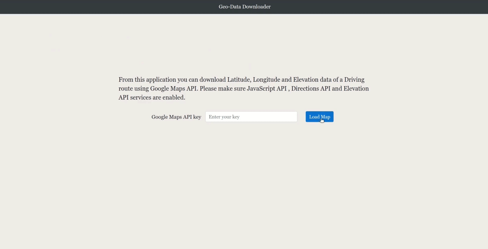
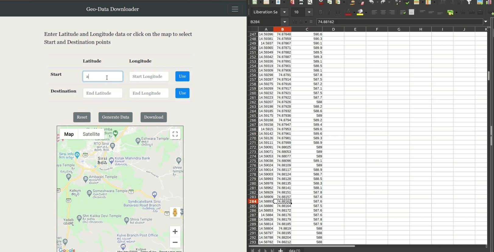

# Geo-Data-Downloader
Using this [application](https://sukumr.github.io/Geo-Data-Downloader/) you can download (.csv file) Latitude, Longitude and Elevation data along a path for Driving mode using Google Maps API.

## Requirements
You need a Google Maps API key with following services enabled.
- Javascript API  
- Directions API  
- Elevation API   

## How to use
- **Marking Start and Destination:**  
You can select **Start** and **Destination** locations either by clicking on the map or by entering latitude and longitude    values in the space provided. 

- **Generating data:**  
  By clicking **Generate Data** button you can generate latitude, longitude and elevation data.
  
- **Downloading data:**  
  By clicking **Download** button you can download the data.
  
- **Reset:**  
  Reset the selections, inputs or generated data by using **Reset** button.

## Demo
### How to use

### Error handling for API key input

### Error handling using Regular Expression for input fields

